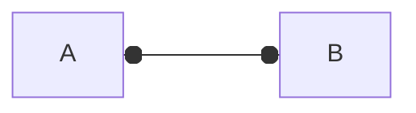
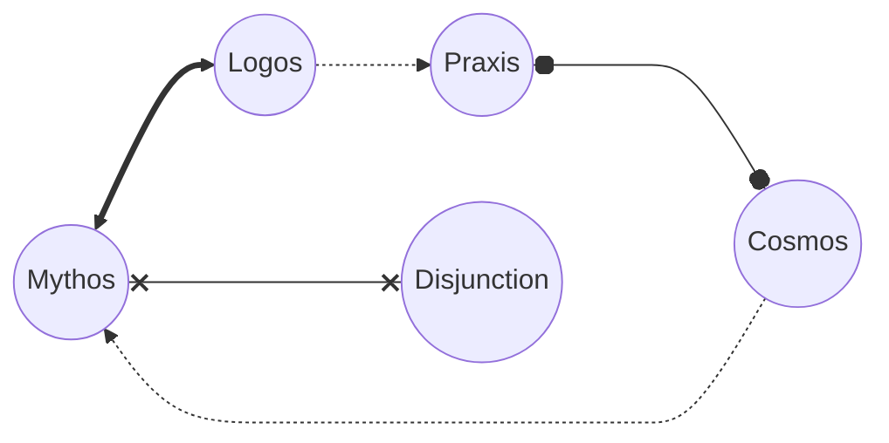
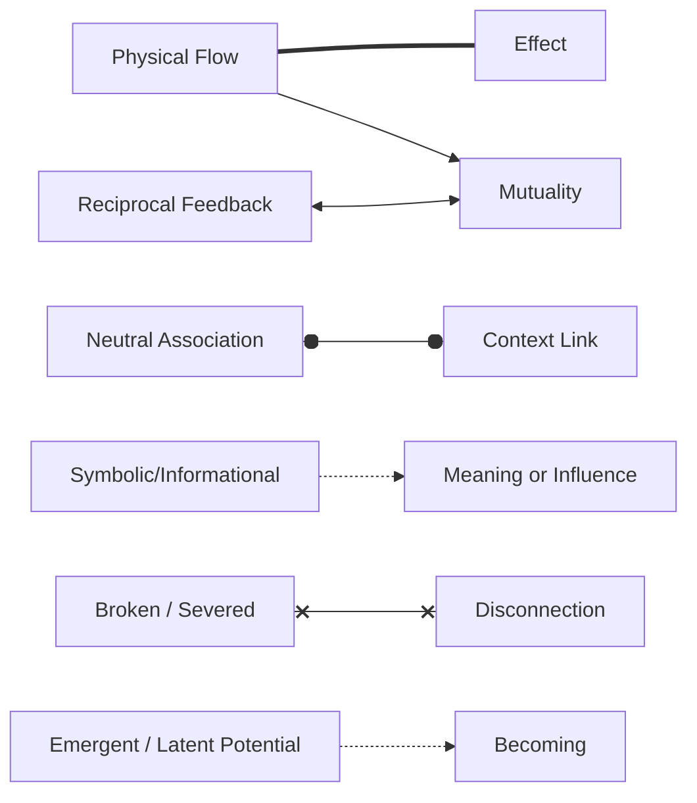
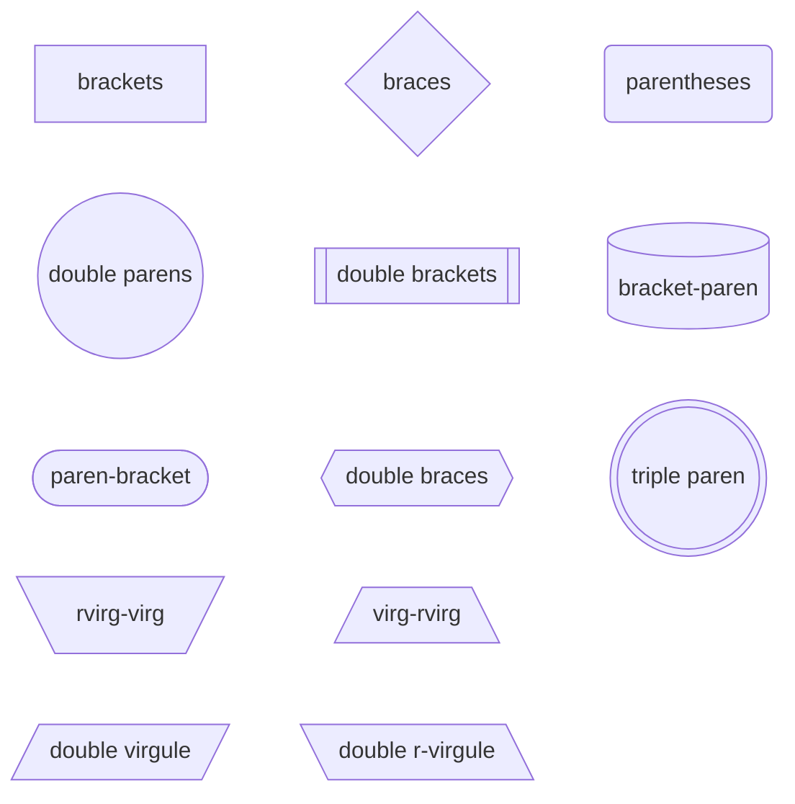
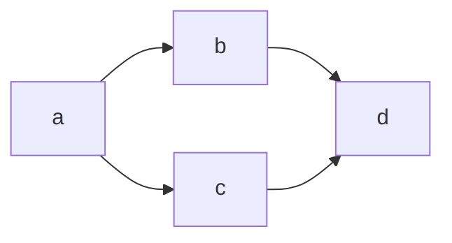
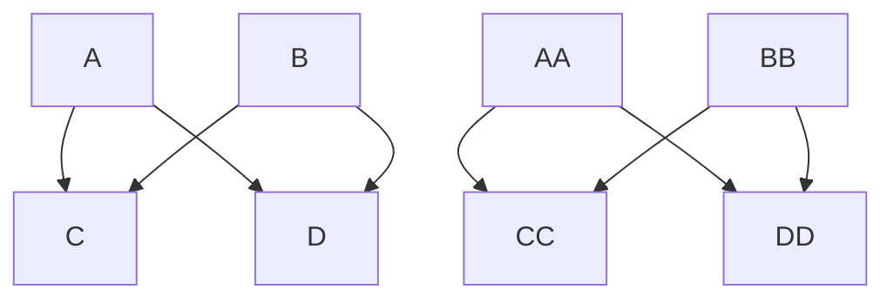
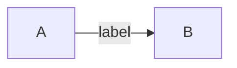
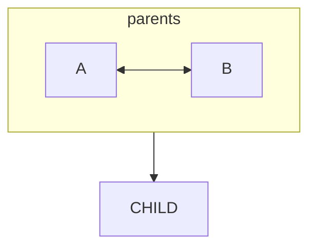

```mermaid
flowchart LR
	A o---o B
```

```mermaid
flowchart LR
    Mythos((Mythos)) <==> Logos((Logos))
    Logos -.-> Praxis((Praxis))
    Praxis o---o Cosmos((Cosmos))
    Cosmos o-.-> Mythos
    Mythos x---x Chaos((Disjunction))
```

```mermaid
flowchart LR
    A1[Physical Flow] === B1[Effect]
    A1[Physical Flow] --> B2[Mutuality]
    A2[Reciprocal Feedback] <--> B2[Mutuality]
    A3[Neutral Association] o--o B3[Context Link]
    A4[Symbolic/Informational] -.-> B4[Meaning or Influence]
    A5[Broken / Severed] x--x B5[Disconnection]
    A6[Emergent / Latent Potential] o-.-> B6[Becoming]
```

~~~

```mermaid
flowchart LR 
    A[brackets]~~~
    B{braces}~~~
    C(parentheses)
    
    D((double parens))~~~
	E[[double brackets]]~~~
	F[(bracket-paren)]
	
	G([paren-bracket])~~~
	H{{double braces}}~~~
	I(((triple paren)))
	
	J[\rvirg-virg/]~~~
	K[/virg-rvirg\]

	L[/double virgule/]~~~
	M[\double r-virgule\]
```
~~~
~~~

```mermaid
flowchart LR
	a --> b & c--> d
```
~~~

```mermaid
flowchart LR
	a --> b & c--> d
```

~~~

```mermaid
flowchart TB
    A --> C
    A --> D
    B --> C
    B --> D
%% Is the same as:
	AA & BB --> CC & DD
```
~~~

```mermaid
flowchart TB
    A --> C
    A --> D
    B --> C
    B --> D
    %% Is the same as:
	AA & BB --> CC & DD
```

```mermaid
flowchart LR 
    A[brackets]~~~
    B{braces}~~~
    C(parentheses)
    
    D((double parens))~~~
	E[[double brackets]]~~~
	F[(bracket-paren)]
	
	G([paren-bracket])~~~
	H{{double braces}}~~~
	I(((triple paren)))
	
	J[\rvirg-virg/]~~~
	K[/virg-rvirg\]

	L[/double virgule/]~~~
	M[\double r-virgule\]
```

```mermaid
flowchart LR

%% ============================
%%  GEOMETRIC SHAPES -A
%% ============================
subgraph Geometric
    AG@{ shape: circle, label: "circle" }
    AH@{ shape: dbl-circ, label: "dbl-circ" }
    AR@{ shape: cross-circ, label: "cross-circ" }
    R@{ shape: tri, label: "tri" }
    X@{ shape: flip-tri, label: "flip-tri" }
end

%% ============================
%%  GEOMETRIC SHAPES -B
%% ============================
subgraph Geometric-B

    AD@{ shape: hex, label: "hex" }
    AB@{ shape: odd, label: "odd" }
    Y@{ shape: sl-rect, label: "sl-rect" }
    AN@{ shape: pill, label: "pill" }
    AO@{ shape: text, label: "text" }
end

%% ============================
%%  RECTANGULAR VARIANTS (A)
%% ============================
subgraph Rectangular_A
    AF@{ shape: rect, label: "rect" }
    Q@{ shape: rounded, label: "rounded" }
    A@{ shape: notch-rect, label: "notch-rect" }
end

%% ============================
%%  RECTANGULAR VARIANTS (B)
%% ============================
subgraph Rectangular_B
    V@{ shape: lin-rect, label: "lin-rect" }
    W@{ shape: notch-pent, label: "notch-pent" }
end


%% ============================
%%  RECTANGULAR VARIANTS (C)
%% ============================
subgraph Rectangular_C
    AJ@{ shape: fr-rect, label: "fr-rect" }
    AP@{ shape: f-circ, label: "f-circ" }
    AQ@{ shape: fr-circ, label: "fr-circ" }
    AL@{ shape: tag-doc, label: "tag-doc" }
end

%% ============================
%%  RECTANGULAR VARIANTS (D)
%% ============================
subgraph Rectangular_D
    AM@{ shape: tag-rect, label: "tag-rect" }
    AI@{ shape: bow-rect, label: "bow-rect" }
    AC@{ shape: flag, label: "flag" }
end

%% ============================
%%  TRAPEZOIDS & ANGLED
%% ============================
subgraph Angled
    N@{ shape: curv-trap, label: "curv-trap" }
    Z@{ shape: trap-t, label: "trap-t" }
    AE@{ shape: trap-b, label: "trap-b" }
end

%% ============================
%%  TRAPEZOIDS & ANGLED (B)
%% ============================
subgraph Angled_B
    N@{ shape: curv-trap, label: "curv-trap" }
    Z@{ shape: trap-t, label: "trap-t" }
    AE@{ shape: trap-b, label: "trap-b" }
    G@{ shape: lean-r, label: "lean-r" }
    H@{ shape: lean-l, label: "lean-l" }
end

%% ============================
%%  DOCUMENT-BASED
%% ============================
subgraph Docs
    P@{ shape: doc, label: "doc" }
    AA@{ shape: docs, label: "docs" }
    U@{ shape: lin-doc, label: "lin-doc" }
end

%% ============================
%%  CYLINDERS & STORAGE
%% ============================
subgraph Cylinders
    I@{ shape: cyl, label: "cyl" }
    L@{ shape: h-cyl, label: "h-cyl" }
    M@{ shape: lin-cyl, label: "lin-cyl" }
    J@{ shape: diam, label: "diam" }
end

%% ============================
%%  PROCESS / FLOW SYMBOLS
%% ============================
subgraph FlowSymbols
    B@{ shape: hourglass, label: "hourglass" }
    K@{ shape: delay, label: "delay" }
    T@{ shape: win-pane, label: "win-pane" }
    C@{ shape: bolt, label: "bolt" }
    AS@{ shape: join, label: "join" }
end

%% ============================
%%  DIVIDED / SPECIAL CONTAINERS
%% ============================
subgraph Containers
    O@{ shape: div-rect, label: "div-rect" }
    F@{ shape: braces, label: "braces" }
    D@{ shape: brace, label: "brace" }
    E@{ shape: brace-r, label: "brace-r" }
end

```

```mermaid
flowchart LR
	A -- "label" --> B
```

```mermaid
flowchart TD
subgraph parents
	direction LR
	A <--> B
end
	parents --> CHILD
```

